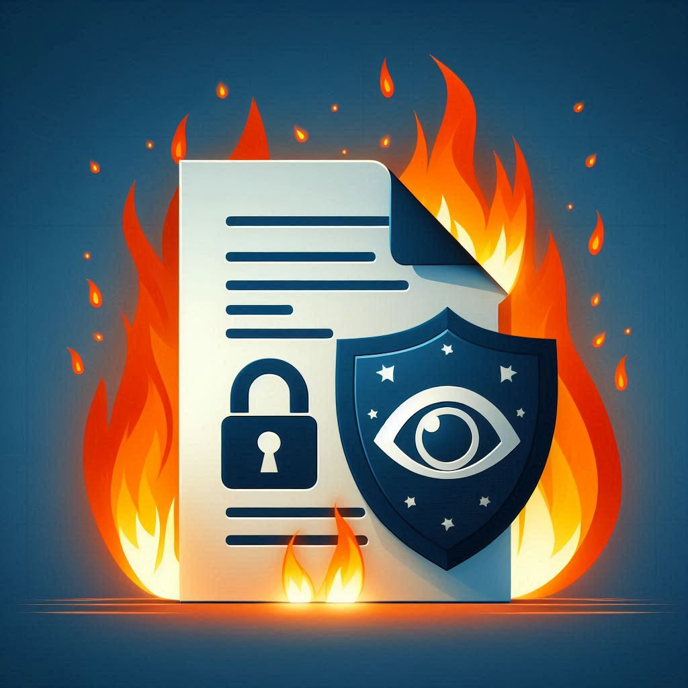

# BurnAfterReading

A simple and secure self-hosted web application with no dependencies for sharing text snippets and files (an attachment). 

The content is saved encrypted on the server and the key is only available once as a link for the administrator (creator) when the content has been created. 

The content is immediately deleted (burned) after the first successful access. 

The access is protected by a one-time password which is also displayed only once to the administrator when the content has been created.

When someone tries to access the content with an invalid password or an invalid link, access is denied and the client IP address is blocked after three failed attempts for ten minutes.

## Requirements

- Requires PHP 7.1 or higher. PHP 8.x is recommended.
- Requires php-sqlite3 extension.

## Installation

### 1. Install php-sqlite3

The SQLite3 extension is enabled in PHP by default.

To check if it is enabled, run:

```bash
php -m | grep sqlite3
```
If the extension is not enabled, you can enable it by installing the php-sqlite3 package.

Install php-sqlite3 extension under Debian/Ubuntu:

```bash
sudo apt-get install php-sqlite3
# Or a concrete version e.g.
sudo apt-get install php8.3-sqlite3
```

### 2. Create password hash for admin area

Create ```pwd.php``` file in ```BurnAfterReadingApp``` which returns a hashed password string.

Generate string in PHP interactive shell console with e.g.

```bash
php -a
```

```php
echo password_hash('MyGreatSecret', PASSWORD_DEFAULT);
```

Copy the String into ```pwd.php``` as a return statement with e.g.:

```php
<?php
return '$2y$10$vH0sp9VPFAnAnw2OrSX8BOXfx2KSB2orwydGq1lsdMFk50h9oTDcW';
```

### 3. Set DocumentRoot

Set the `DocumentRoot` to ```/path/to/this/repo/public``` directory in your HTTP-server configuration.

You can also just copy the content of ```public``` (the ```bar``` directory) to your server's DocumentRoot.
If you do so, keep in mind that it is assumed that the ```BurnAfterReadingApp``` directory is in the same directory as the ```public``` directory.
If you move the ```BurnAfterReadingApp``` directory, you have to adjust the paths in ```public/bar/index.php``` accordingly:

```php
require __DIR__ . '/../../BurnAfterReadingApp/vendor/autoload.php';
```

and in ```public/bar/admin/index.php```:

```php
require __DIR__ . '/../../../BurnAfterReadingApp/vendor/autoload.php';
```

You can also rename the ```bar``` and the ```bar/admin``` directories to something else.

### 4. Make data directory writable

Make the ```BurnAfterReadingApp/data``` directory writable by the web server user e.g.:

```bash
chown -R www-data:www-data ./BurnAfterReadingApp/data
```

## Usage

To create a new content entry, open the admin area in your browser e.g.:

```
https://your-server/bar/admin
```

Enter the password you have set in ```pwd.php``` and create a new content.

Copy the link and the password and share it with the recipient.

The recipient can access the content by opening the link in the browser and entering the password.

After the first successful access, the content is deleted from the server.

If the link and the password have been intercepted and used by a third party, the access is denied and the user gets a message stating: "Something went wrong. Please contact the person who sent you this link immediately!"

## License

This project is licensed under the MIT License - see the [LICENSE](LICENSE) file for details.