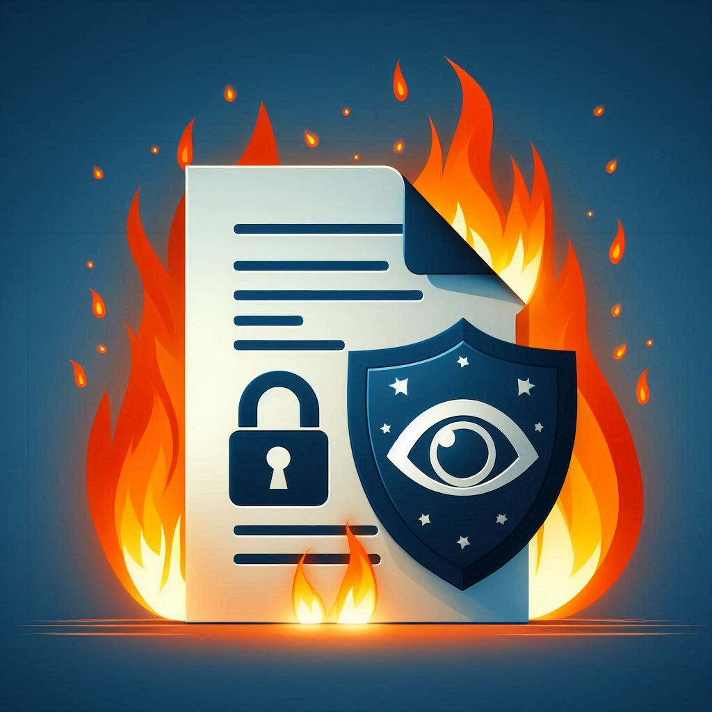

# BurnAfterReading

A simple and secure self-hosted web application for sharing text snippets and files (an attachment). 

The content is saved encrypted on the server and the key is only available once as a link for the administrator (creator) when the content has been created. 

The content is immediately deleted (burned) after the first successful access. 

The access is protected by a one-time password which is also displayed only once to the administrator when the content has been created.

When someone tries to access the content with an invalid password or an invalid link, access is denied and the client IP address is blocked after three failed attempts for ten minutes.

If enabled in the configuration, the application can send an email notification to the administrator when the content is accessed.

The application can be installed on any web server that supports PHP or run as a Docker container.

## Docker Installation

### Requirements

- Docker
- Docker Compose v2.x
- HTTP-Proxy like Apache or Nginx on the host system

### 1. Configuration

#### Environment variables

Rename the `.env.example` file to `.env` and update the environment variables with your own values:

| Variable | Description | Default |
|----------|-------------|---------|
| `ADMIN_PASSWORD` | Password for the admin area | `secret` |
| `ADMIN_SUBDIR` | Subdirectory name for the admin area | `admin` |
| `TIMEZONE` | Timezone for the application | `Europe/Berlin` |
| `BAR_PORT` | Port the container listens on | `8080` |
| `MAX_EXECUTION_TIME` | PHP max execution time in seconds | `600` |
| `MEMORY_LIMIT` | PHP memory limit | `512M` |
| `UPLOAD_LIMIT` | PHP upload/post max size | `512M` |

All environment variables are applied at container startup — no rebuild required when changing values. Just restart the container.

#### Application config

Rename `BurnAfterReadingApp/config.example.php` to `BurnAfterReadingApp/config.php` and edit it to your needs.

The `config.php` file is bind-mounted into the container (read-only), so changes take effect on the next request without rebuilding.

### 2. Build Docker Image

You don't have to build the Docker image yourself, the image is available on Docker Hub as [`solarbaypilot/bar`](https://hub.docker.com/r/solarbaypilot/bar) and will be pulled automatically when you run `docker compose up` for the first time.

If you want to build the image yourself, run:

```bash
cd BurnAfterReadingApp
composer install --no-dev
```

Then go back to the root directory and run:
```bash
docker compose build
```

### 3. Usage

```bash
docker compose up -d
```

### 4. HTTP-Proxy

You will need to use an HTTP-Proxy like Apache or Nginx to serve the application over HTTPS.

Here is an example configuration for Apache:

```apacheconf
# make sure to enable the following modules in Apache:
# a2enmod ssl
# a2enmod proxy
# a2enmod proxy_http
# a2enmod headers
# a2enmod remoteip

<VirtualHost *:80>
    ServerAdmin webmaster@localhost
    ServerName yourdomain.tld
    ServerSignature Off

    DocumentRoot /var/www/html
    Redirect permanent / https://yourdomain.tld/

    ErrorLog ${APACHE_LOG_DIR}/yourdomain.tld_error.log
    CustomLog ${APACHE_LOG_DIR}/yourdomain.tld_access.log combined
</VirtualHost>
<IfModule mod_ssl.c>
    <VirtualHost *:443>
        ServerAdmin webmaster@localhost
        ServerName yourdomain.tld
        ServerSignature Off

        DocumentRoot /var/www/html

        SSLEngine on
        SSLCertificateFile /etc/ssl/certs/yourdomain.tld.crt
        SSLCertificateKeyFile /etc/ssl/private/yourdomain.tld.key

        SSLProtocol all -SSLv3 -TLSv1 -TLSv1.1
        SSLCipherSuite ECDHE-ECDSA-AES128-GCM-SHA256:ECDHE-RSA-AES128-GCM-SHA256:ECDHE-ECDSA-AES256-GCM-SHA384:ECDHE-RSA-AES256-GCM-SHA384:ECDHE-ECDSA-CHACHA20-POLY1305:ECDHE-RSA-CHACHA20-POLY1305:DHE-RSA-AES128-GCM-SHA256:DHE-RSA-AES256-GCM-SHA384:DHE-RSA-CHACHA20-POLY1305

        SSLHonorCipherOrder on
        SSLSessionTickets off

        Header set X-Content-Type-Options "nosniff"
        Header set Content-Security-Policy "frame-ancestors 'self';"
        Header always set Strict-Transport-Security "max-age=31536000; includeSubDomains; preload"
        
        # not needed as the app is already setting these headers, 
        # but it doesn't hurt to set them here as well:
        # Header always set Referrer-Policy "no-referrer"
        # Header always set Permissions-Policy "camera=(), microphone=(), geolocation=()"

        # this needs mod_remoteip and is needed for the reverse proxy to get the correct client IP address in the application logs and for the brute-force protection to work correctly:
        
        RemoteIPHeader X-Forwarded-For
        # adjust the IP range to your needs, this is the default private IP range for Docker containers, if you are using a different setup, you might need to adjust this:
        RemoteIPInternalProxy 172.16.0.0/12

        # this is important for the reverse proxy
        RequestHeader set X-Forwarded-Proto "https"

        Protocols h2 http/1.1

        ProxyPreserveHost On
        # set the correct port which you set in .env BAR_PORT here:
        ProxyPass / http://localhost:8080/
        ProxyPassReverse / http://localhost:8080/

        ErrorLog ${APACHE_LOG_DIR}/yourdomain.tld_error.log
        CustomLog ${APACHE_LOG_DIR}/yourdomain.tld_access.log combined
    </VirtualHost>
</IfModule>
```

## Manual Installation

### Requirements

- PHP 7.1 or higher (PHP 8.x recommended)
- php-sqlite3 extension (enabled in PHP by default)
- Composer
- SSL connection — HTTPS is required for secure communication

### 1. Install dependencies

```bash
cd BurnAfterReadingApp
composer install --no-dev
```

### 2. Check if php-sqlite3 extension is enabled

The SQLite3 extension is enabled in PHP by default.

To check if it is enabled, run:

```bash
php -m | grep sqlite3
```
If the extension is not enabled, you can enable it by installing the php-sqlite3 package.

Install php-sqlite3 extension under Debian/Ubuntu:

```bash
sudo apt-get install php-sqlite3
# Or a concrete version e.g.
sudo apt-get install php8.3-sqlite3
```

### 3. Create password hash for admin area

Create ```pwd.php``` file in ```BurnAfterReadingApp``` which returns a hashed password string.

Generate string in PHP interactive shell console with e.g.

```bash
php -a
```

```php
echo password_hash('MyGreatSecret', PASSWORD_DEFAULT);
```

Copy the String into ```pwd.php``` as a return statement with e.g.:

```php
<?php
return '$2y$10$vH0sp9VPFAnAnw2OrSX8BOXfx2KSB2orwydGq1lsdMFk50h9oTDcW';
```

### 4. Configure the application

Rename `BurnAfterReadingApp/config.example.php` to `BurnAfterReadingApp/config.php` and edit it to your needs (mail settings, language, etc.).

### 5. Set DocumentRoot

Set the `DocumentRoot` to ```/path/to/this/repo/public``` directory in your HTTP-server configuration.

You can also just copy the content of ```public``` (the ```bar``` directory) to your server's DocumentRoot.
If you do so, keep in mind that it is assumed that the ```BurnAfterReadingApp``` directory is in the same directory as the ```public``` directory.
If you move the ```BurnAfterReadingApp``` directory, you have to adjust the paths in ```public/bar/index.php``` accordingly:

```php
require __DIR__ . '/../../BurnAfterReadingApp/vendor/autoload.php';
```

and in ```public/bar/admin/index.php```:

```php
require __DIR__ . '/../../../BurnAfterReadingApp/vendor/autoload.php';
```

You can also rename the ```bar``` and the ```bar/admin``` directories to something else.

### 6. Make data directories writable

Make the ```BurnAfterReadingApp/data```  and the ```BurnAfterReadingApp/db``` directory writable by the web server user e.g.:

```bash
chown -R www-data:www-data ./BurnAfterReadingApp/data
chown -R www-data:www-data ./BurnAfterReadingApp/db
```

## Usage

To create a new content entry, open the admin area in your browser e.g.:

```
https://your-server/bar/admin
```

Enter the password you have set in ```pwd.php``` and create a new entry.

Copy the link and the password and share it with the recipient.

The recipient can access the content by opening the link in the browser and entering the password.

After the first successful access, the content is deleted from the server.

If the link and the password have been intercepted and used by a third party, the access is denied and the user gets a message stating: "Something went wrong. Please contact the person who sent you this link immediately!"

## License

This project is licensed under the MIT License - see the [LICENSE](LICENSE) file for details.